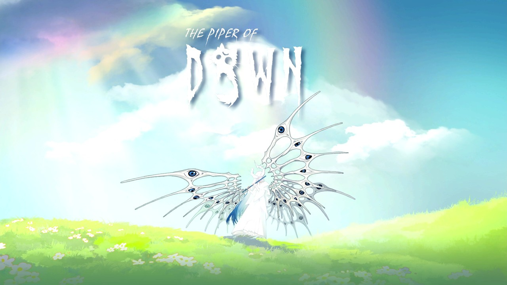

# 黎明门前的吹笛人 (The Piper of Dawn) 한국어 패치

Steam 게임 **黎明门前的吹笛人 (The Piper of Dawn)**의 비공식 한국어 패치입니다.

## 설치

1. [Releases](../../releases)에서 최신 `ThePiperOfDawn_KoreanPatch_v*.zip`을 받습니다.
2. zip 안의 `ThePiper_Data` 폴더를 게임 폴더(`ThePiper.exe`가 있는 폴더)에 붙여넣어 덮어쓴 뒤, 게임 설정에서 언어를 **English**로 바꿉니다.

## 번역 범위

| 항목 | 번역 |
|---|---|
| 대사·스토리 | O |
| UI·아이템·퀘스트 | O |
| 화면에 고정된 UI 글자 | O |
| 이미지 속 글자(로고 등) | X |

## 면책

팬 번역이며 개발사·배급사와 관계가 없습니다. 게임의 권리는 각 권리자에게 있습니다.
